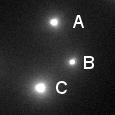


= Dimensions

[.chapter-outline]
.Chapter outline
--
* The number of dimensions of an image is the number of pieces of information required to identify each pixel
* In ImageJ, images with more than 2 dimensions are stored in a stack or hyperstack
--

== Identifying dimensions

The idea of image dimensions is straightforward: the number of
dimensions is the number of pieces of information you need to know to
identify individual pixels.

For example, in the most familiar 2D images, you can uniquely identify a
pixel by knowing its _x_ and _y_ spatial
coordinates. But if you needed to know _x_ and
_y_ coordinates, a _z_-slice number, a color
channel and a time point then you would be working with 5D data
(Figure <<fig-dimensions>>). You could throw away one of these dimensions
– any one at all – and get a 4D image, and keep going until you have a
single pixel remaining: a 0D image. Throw away that, and you no longer
have an image.

[sidebar]
[[fig-dimensions, 1]]
--
[cols="4*a"]
[frame=none, grid=none, halign=center]
|===
|image::images/dims_0.png[title="0 dimensional" caption="A: " float=center]
|image::images/dims_1.png[title="1 dimensional" caption="B: " float=center]
|image::images/dims_2.jpg[title="2 dimensional" caption="C: " float=center]
|image::images/dims_3.jpg[title="3 dimensional" caption="D: " float=center]
|
|image::images/dims_4.jpg[title="4 dimensional" caption="E: " float=center]
|image::images/dims_5.jpg[title="5 dimensional" caption="F: " float=center]
|
|===
**Figure {counter:figure}:**
Depictions of images with different numbers of dimensions.
(A) A single value is considered to have 0 dimensions.
(B--F) Additional dimensions are added, here in the following order: _x_ coordinate (1), _y_ coordinate (2), channel number (3), _z_ slice (4) and time point (5).
--

In principle, therefore, 2D images do not need to have _x_
and _y_ dimensions. The dimensions could be _x_
and _z_, or _y_ and time, for example. But while
we may play around with the identity of dimensions, the important fact
remains: an __n__D image requires _n_ pieces of
information to identify each pixel.

[[stacks-hyperstacks]]
Stacks & Hyperstacks
--------------------

In the beginning there were 2D images. Then ImageJ supported _stacks_,
which allowed an extra dimension that could either include different
time points or _z_-slices – but not both. Nowadays,
_hyperstacks_ are the more flexible derivative of stacks, and can
(currently) store up to 5 dimensions without getting them confused.

.Hyperstack flexibility
[.info]
****
A hyperstack can contain 0–5 dimensions, while a
stack can only contain 0–3. So why worry about stacks at all?

The main reason comes from ImageJ's evolution over time. Some commands –
perhaps originating in the pre-hyperstack era – were written only for 2D
or 3D data. Trying to apply them to 4D or 5D images may then cause an
error, or it may simply produce strange results. As commands become
updated the chance of dimension-related errors and strangeness reduces,
and the stack-hyperstack distinction is disappearing.
****

[[navigating-dimensions]]
Navigating dimensions
~~~~~~~~~~~~~~~~~~~~~

With a stack or hyperstack, only a single 2D _slice_ is 'active' at any
one time. Extra sliders at the bottom of the image window are used to
change which slice this is (Figure <<fig-stacks_hyperstacks>>). In the
case of multichannel images, any changes to lookup tables are only made
to slices of the currently-active channel.

[sidebar]
[[fig-stacks_hyperstacks, 2]]
--
[cols="a,a,a"]
[frame=none, grid=none, halign=center, valign=bottom]
|===
|image::images/dim_image.png[title="2D image" caption="A: " float=center]
|image::images/dim_stack.png[title="3D (hyper?)stack" caption="B: " float=center]
|image::images/dim_hyperstack.png[title="4D hyperstack" caption="C: " float=center]
|===
**Figure {counter:figure}:**
Stacks in ImageJ contain 3D data, while hyperstacks contain up to 5 dimensions.
Both include additional sliders, not required for 2D images, to shift along the additional dimensions and make different slices active.
--

[[correcting-dimensions]]
Correcting dimensions
~~~~~~~~~~~~~~~~~~~~~

The dimensions of an image can be seen in the top entries of
menu:Image[Properties...]. Occasionally these can be incorrect: perhaps
different _z_-slices were wrongly interpreted as time points
when a file was opened, or the presence of multiple channels was not
spotted. This can affect not only the display, but also some processing
or measurements. Fortunately, dimensions can be corrected manually using
the command menu:Image[Hyperstack > Stack to Hyperstack...] – provided you
know, or can work out, the right values.

.Practical
[.practical]
****
Something terrible has befallen the file `lost_dimensions.tif`, so that
it is displayed as a 3D stack, when in reality it should have more
dimensions. By inspecting the file, identify how many channels,
_z_-slices and time points it originally contained, and set
these using menu:Image[Hyperstack > Stack to Hyperstack...] so that it displays properly. What
are the correct dimensions?

.Answer
[.solution]
--
`lost_dimensions.tif` should contain 2 channels, 3
_z_-slices and 16 time points.

The dimensions are in the
default order (_xyczt_).
--

****

[[presenting-dimensions]]
Presenting dimensions
---------------------

To the computer, an image is stored as a lot of pixel values,
irrespective of the number of dimensions it should have. However, as the
number of dimensions increases, providing a useful representation of all
the values at once becomes tricky. The _z_ dimension is most
troublesome of all, because there are are relatively natural choices for
channels and time points (i.e. to use different colors and to show a
movie), so we will concentrate on it.

[[viewing-angles-your-data-in-a-box]]
Viewing angles: your data in a box
~~~~~~~~~~~~~~~~~~~~~~~~~~~~~~~~~~

[sidebar]
[[fig-visualize_fiji, 3]]
--
[cols="a,a"]
[frame=none, grid=none, halign=center, valign=bottom]
|===
|image::images/visualize_angles.png[title="Volume rendering" caption="A: " float=center]
|image::images/visualize_orthogonal_labelled.png[title="Orthogonal views" caption="B: " float=center]
|===
**Figure {counter:figure}:**
Two ways to look at 3D data, using the `3D Viewer` for 'volume rendering' and the `Orthogonal Views` command.
--

It is helpful to consider the pixels of 3D data as being densely packed
into a transparent box that could be viewed from different angles
(Figure <<fig-visualize_fiji>>A). Visualizations like this can be made
with menu:Plugins[3D Viewer]. They are particularly good for generating
attractive figures or impressive movies, but details can be hard to
interpret because they are influenced by perspective and which pixels
overlap from our current viewing angle.

To systematically explore data, therefore, it is usually preferable to
look inside the box by generating 2D images from only 3 angles: from
above (_xy_) and from two remaining sides (_xz_
and _yz_). These 3 viewpoints are _orthogonal_ (i.e. they
are oriented at 90 to one another), and the command
menu:Image[Stacks > Orthogonal Views] makes this easy. It opens up 2 extra
windows, so that when you click at any point on the original
_xy_ view, you are shown cross-sections through that point
from each direction.

[[reslicing]]
Reslicing
^^^^^^^^^

The `Orthogonal Views` command really only gives you a temporary look at
the data from different angles, but you do not have full control over
the extra views: you have limited influence over the brightness and
contrast, for example, and all your clicks on the images get intercepted
to update the display, which means you cannot draw <<../rois/rois.adoc#chap, regions of interest>>.

If you instead want to rotate the entire stack so that you can browse
through what are effectively _xz_ or _yz_ slices
and do whatever you want to them, the command you need is
menu:Image[Stacks > Reslice...].

[[z-projections]]
Z-projections
~~~~~~~~~~~~~

Another extremely useful way to collapse the data from 3 dimensions into
2 is to use a _z_-projection. The basic idea is of taking
all the pixels in a stack that have the same _x_ and
_y_ coordinate, applying some operation to them, and putting
the result of that operation into a new 2D image at the same
_x_ and _y_ position.

[sidebar]
[[fig-visualize_fiji_projection, 4]]
--
[cols="a,a,a"]
[frame=none, grid=none, halign=center, valign=bottom]
|===
|image::images/visualize_proj_avg.png[title="Sum projection" caption="A: " float=center]
|image::images/visualize_proj_max.png[title="Maximum projection" caption="B: " float=center]
|image::images/visualize_proj_min.png[title="Minimum projection" caption="C: " float=center]
|===
**Figure {counter:figure}:**
Three projections of a __z__-stack.
Sum projections often look similar to maximum projections, but less sharp.
--

Two important operations in fluorescence imaging are to add all the
pixels with the same _xy_ coordinates (a _sum projection_),
or to compare the pixels and select only the largest values (a _maximum
projection_), both implemented under menu:Image[Stacks > Z Project...]. The
advantage of the first is that every pixel value has an influence on the
result: which is good if you plan to measure intensities in the
projection image (although quantitative analysis of projections can be
somewhat dangerous, e.g. if intensity measurements are compared between
projections made from stacks with different numbers of slices). The
advantage of the second is that it tends to give a nice and sharp
looking image, since structures are at their brightest in the planes
where they are in focus (Figure <<fig-visualize_fiji_projection>>B). Naturally,
you could make a _minimum intensity projection_ if you liked, but a very
out-of-focus-looking image is generally less desirable
(Figure <<fig-visualize_fiji_projection>>C).

.Question
[.question]
****
Imagine computing a sum and a maximum projection of a 10-slice stack
containing a large, in-focus nucleus. How might each of these
projections be affected if your stack contained:

* 4 additional, out-of-focus slices (with non-zero pixel values)
* several very bright, isolated, randomly distributed outlier pixels –
with values twice what they should be (due to noise)

.Answer
[.solution]
--
Additional, out-of-focus planes will have an effect upon sum
projections: increasing all the resulting pixel values. However, the
extra planes would have minimal effects upon maximum projections, since
they are unlikely to contain higher values than the in-focus planes.

Maximum projections will, however, be very affected by bright outliers:
these will almost certainly appear in the result with their values
unchanged. Such outliers would also influence a sum projection, but less
drastically because each pixel would contain the sum of 9 reasonable
values and only 1 large value (unless, by bad luck, many outliers happen
to overlap at the same _xy_ coordinate).
--

****

.Question
[.question]
****
image:images/beads_max.png[title="Projection 2", caption="", float=right]

Shown on the right are sum and maximum projections of an image
containing 3 beads: A, B and C. Which projection is which?

And which projection, if either, would be suitable for determining the pair of
beads that are closest to one another?

.Answer
[.solution]
--
Identifying the projections is tricky since the contrast settings could
be misleading, although here they are not... Projection 1 (on the left) is the sum projection,
and Projection 2 (on the right) is the maximum projection. The sum projection looks less sharp
since the regions around the beads contains out-of-focus light, which
becomes more obvious when all the slices are added.

As for determining the distance between beads, neither projection is
very good. Either could be used to determine the distance in
_x_ and _y_, but if one bead is much, much
deeper in the stack then all information about this _z_
displacement would be lost in the projection. This is one reason why it
is not good to base analysis on projections alone. `Orthogonal views`
would help.
--

****

.Practical
[.practical]
****
Z-projections are all very well, but how would you make an
_x_, _y_ or _time_ projection?

If you want to try this out, you can use the image
menu:File[Open Samples > Mitosis], which has all 5 dimensions to work with.

[cols="3*a"]
[frame=none, grid=none, halign=center, width=80%]
|===
|image::images/max_z.png[title="_Max z-projection_" caption="" float=center]
|image::images/max_time.png[title="_Max time-projection_" caption="" float=center]
|image::images/max_x.png[title="_Max x-projection_" caption="" float=center]
|===

_Note:_ Choose menu:File[Open Samples > Cache Sample Images] to avoid
needing to re-download sample images every time you want them.

.Answer
[.solution]
--
The menu:Image[Stacks > Z Project...] command will also work on time series to make a time
projection, assuming there are not extra _z_-slices present
too. If there are, you can use
menu:Image[Hyperstack > Re-order Hyperstacks...] or menu:Image[Hyperstack > Stack{sp}to{sp}Hyperstack...] to
switch the dimension names and trick ImageJ into doing what you want.

You can make _x_ and _y_ projections by running
menu:Image[Stacks > Reslice...] first, then making the projection.
--

****
