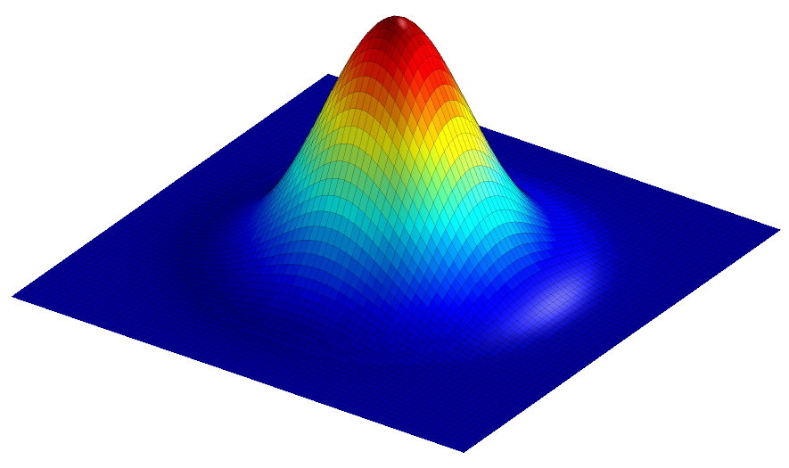


= Filters

[.chapter-outline]
.Chapter outline
--
* Filters can be used to reduce noise and/or enhance features, making detection & measurement much easier
* Linear filters replace each pixel by a weighted sum of surrounding pixels
* Nonlinear filters replace each pixel with the result of some other computation using surrounding pixels
* Gaussian filters have various advantages that make them a good choice for many applications with fluorescence images
--

[[introduction]]
Introduction
------------

Filters are phenomenally useful. Almost all interesting image analysis
involves filtering of some sort at some stage. In fact, the analysis of
a difficult image sometimes becomes trivial once a suitable filter has
been applied to it. It is therefore no surprise that much of the image
processing literature is devoted to the topic of designing and testing
filters.

The basic idea of filtering here is that each pixel in an image is
assigned a new value depending upon the values of other pixels within
some defined region (the pixel's _neighborhood_). Different filters
work by applying different calculations to the neighborhood to get
their output. Although the plethora of available filters can be
intimidating at first, knowing only a few of the most useful is already
a huge advantage.

This chapter begins by introducing several extremely common _linear_ and
_nonlinear_ filters for image processing. It ends by considering in
detail some techniques based on one particularly important linear
filter.

[[sec-processing_linear_filtering]]
Linear filtering
----------------

Linear filters replace each pixel with a _linear combination_ ('sum of
products') of other pixels. Therefore the only mathematical background
they require is the ability to add and multiply.

[[sec-processing_mean]]
Mean filters
~~~~~~~~~~~~

To begin, consider the somewhat noisy image of a yeast cell in
Figure <<fig-filt_yeast>>(A).

[sidebar]
[[fig-filt_yeast, 1]]
--
[cols="a,a,a"]
[frame=none, grid=none, halign=center]
|===
|image::images/yeast.png[align=center]
|image::images/yeast_mean.png[align=center]
|image::images/yeast_mean_subtract.png[align=center]

|image::images/yeast_plot.png[title="Original image" caption="A: " float=center]
|image::images/yeast_mean_plot.png[title="Mean filtered" caption="B: " float=center]
|image::images/yeast_mean_subtract_plot.png[title="Subtraction (A) - (B)" caption="C: " float=center]
|===
**Figure {counter:figure}:**
Filters can be used to reduce
noise. A spinning disc confocal image of a yeast cell. Applying a small
mean filter makes the image smoother, as is particularly evident in the
fluorescence plot made through the image center. Computing the
difference between images shows what the filter removed, which was
mostly random noise.
--

The noise can be seen in the random jumps in the
fluorescence intensity profile shown. One way to improve this is to take
each pixel, and simply replace its value with the mean (average) of
itself and the 8 pixels immediately beside it (including diagonals).
This 'averages out' much of this noisy variation, giving a result that
is considerably smoother (B). Subtracting the smoothed image from the
original shows that what has been removed consists of small positive and
negative values, mostly (but not entirely) lacking in interesting
structure \(C).

This smoothing is what a 3 × 3 __mean
filter__footnote:[Also called an _arithmetic mean_, _averaging_ or
_box-car filter_.] does. Each new pixel now depends upon the average of
the values in a 3 × 3 pixel region: the noise is
reduced, at a cost of only a little spatial information. The easiest way
to apply this in ImageJ is through the menu:Process[Smooth]
commandfootnote:[Note that the shortcut is kbd:[Shift + S] – a fact I
rediscover regularly when intending to save my images. Be careful!]. But
this simple filter could be easily modified in at least two ways:

1.  Its size could be increased. For example, instead of using just the
pixels immediately adjacent to the one we are interested in, a
5 × 5 mean filter replaces each pixel by the average
of a square containing 25 pixels, still centered on the main pixel of
interest.
2.  The average of the pixels in some other shape of region could be
computed, not just an _n_ × _n_ square.

menu:Process[Filters > Mean...] is ImageJ's general command for mean
filtering. It uses approximately circular neighborhoods, and the
neighborhood size is adjusted by choosing a `Radius` value. The
`Show Circular Masks` command displays the neighborhoods used for
different values of `Radius`. If you happen to choose `Radius = 1`, you
get a 3 × 3 filter – and the same results as using
`Smooth`.

[sidebar]
[[fig-mean_filter_sizes, 2]]
--
[cols="a,a,a,a"]
[frame=none, grid=none, halign=center]
|===
|image::images/yeast_mean_radius_orig.png[align=center]
|image::images/yeast_mean_radius_1.png[align=center]
|image::images/yeast_mean_radius_5.png[align=center]
|image::images/yeast_mean_radius_10.png[align=center]

|image::images/yeast_mean_radius_orig_plot.png[title="Original image" caption="A: " float=center]
|image::images/yeast_mean_radius_1_plot.png[title="Filtered, radius=1" caption="B: " float=center]
|image::images/yeast_mean_radius_5_plot.png[title="Filtered, radius=5" caption="C: " float=center]
|image::images/yeast_mean_radius_10_plot.png[title="Filtered, radius=10" caption="D: " float=center]
|===
**Figure {counter:figure}:**
Smoothing an image using mean filters with different radii.
--

Figure <<fig-mean_filter_sizes>> shows that as the radius increases, the
image becomes increasingly smooth – losing detail along with noise. This
causes the result to look blurry. If noise reduction is the primary
goal, it is therefore best to avoid unnecessary blurring by using the
smallest filter that gives acceptable results. More details on _why_
mean filters reduce noise, and by how much, will be given in
the chapter on <<../formation_noise/formation_noise.adoc#chap, Noise>>.

.Question
[.question]
****
Setting `Radius = 6` gives a circular filter that replaces
each pixel with the mean of 121 pixels. Using a square
11 × 11 filter would also replace each pixel with the
mean of 121 pixels. Can you think of any advantages in using the
circular filter rather than the square filter?

.Answer
[.solution]
--
Circles are more 'compact'. Every point on the perimeter of a
circle is the same distance from the center. Therefore using a circular
filter involves calculating the mean of all pixels a distance of
$$\leq$$ `Radius` pixels away from the center. For a square
filter, pixels that are further away in diagonal directions than
horizontal or vertical directions are allowed to influence the results.
If a pixel is further away, it is more likely to have a very different
value because it is part of some other structure.
--
****

[[sec-filters_linear_general]]
General linear filters
~~~~~~~~~~~~~~~~~~~~~~

There are various ways to compute a mean of __N__ different
pixels. One is to add up all the values, then divide the result by
__N__. Another is to multiply each value by __1/N__,
then add up the results. The second approach has the advantage that it
is easy to modify to achieve a different outcome by changing the weights
used to scale each pixel depending upon where it is. This is how a
_linear filter_ works in general, and mean filters are simply one
specific example.

[sidebar]
[[fig-filter_shapes, 3]]
--
[cols="a,a,a,a"]
[frame=none, grid=none, halign=center]
|===
|image::images/filter_mean_9.png[title="3 × 3 square" caption="A: " float=center]
|image::images/filter_mean_25.png[title="5 × 5 square" caption="B: " float=center]
|image::images/filter_mean_13.png[title="Circular, radius = 1.5" caption="C: " float=center]
|image::images/filter_mean_21.png[title="Circular, radius = 2" caption="D: " float=center]
|===
**Figure {counter:figure}:**
The kernels used with several mean filters. Note that \(C) and (D) are the 'circular' filters used by ImageJ's `Mean...` command for different radii.
--

A linear filter is defined by a _filter kernel_ (or _filter mask_). This
resembles another (usually small and rectangular) image in which each
pixel is known as a _filter coefficient_ and these correspond to the the
weights used for scaling. In the case of a mean filter, the coefficients
are all the same (or zero, if the pixel is not part of the
neighborhood), as shown in Figure <<fig-filter_shapes>>. But different
kernels can give radically different results, and be designed to have
very specific properties.

An algorithm to apply the filtering is shown in Figure <<fig-convolution>>.

[sidebar]
[[fig-convolution, 4]]
--
[cols="a"]
[frame=none, grid=none, halign=center]
|===
|image::images/conv_1.png[title="The filter is positioned over the top corner of the image. The products of the filter coefficients and the corresponding image pixel values are added together, and the result inserted in a new output image (although here the output is displayed in the original image to save space)." caption="A: " float=center]
|image::images/conv_2.png[title="The filter is shifted to the next pixel in line, and the process repeated." caption="B: " float=center]
|image::images/conv_3.png[title="The filtering continues into the third pixel." caption="C: " float=center]
|image::images/conv_end.png[title="The filtering operation is applied to all pixels in the image to produce the final output." caption="D: " float=center]
|===
**Figure {counter:figure}:**
Applying a linear filter to an image containing
two non-zero pixels using the sum-of-products algorithm. The result is
an image that looks like it contains two (scaled) versions of the filter
itself, which in this case overlap with one another.
--

.Question
[.question]
****
When filtering, the output for each pixel is usually put into
a new image – so that the original image is unchanged (although ImageJ
might switch the new image in place of the old as soon as it is
finished, so that it _looks_ like the image was changed).

Is the creation of a new image really necessary for the algorithm in
Figure <<fig-convolution>> to work, or does it just prevent the old image
being lost – allowing you to retrieve it by pressing `Undo`?

.Answer
[.solution]
A new image is needed for the algorithm to work. Otherwise, if
we put the results directly into the image we are still filtering then
we would only be guaranteed to get the correct result for the first
pixel. For later pixels, computations would involve a combination of
original and already-filtered pixel values, which would most likely give
a different final result.
--
****

[[defining-your-own-filters]]
Defining your own filters
~~~~~~~~~~~~~~~~~~~~~~~~~

The application of such filtering is often referred to as _convolution_,
and if you like you can go wild inventing your own filters using the
menu:Process[Filters > Convolve...] command. This allows you to choose
which specific coefficients the filter should have, arranged in rows and
columns. If you choose the `Normalize Kernel` option then the
coefficients are scaled so that they add to 1 (if possible), by dividing
by the sum of all the coefficients.

.Question
[.question]
****
When defining an _n_ × _n_ filter kernel with
`Convolve...`, ImageJ insists that __n__ is an odd number.
Why?

.Answer
[.solution]
If __n__ is an odd number, the filter has a clear
central pixel. This makes things easier whenever using the approach
outlined in Figure <<fig-convolution>>.
--
****

.Question
[.question]
****
Predict what happens when you convolve an image using a filter
that consists of a single coefficient with a value -1 in the following
cases:

1.  `Normalize Kernel` is checked
2.  You have a 32-bit image (`Normalize Kernel` is unchecked)
3.  You have an 8-bit image (`Normalize Kernel` is unchecked)

.Answer
[.solution]
--
The results of convolving with a single -1 coefficient in
different circumstances:

1.  _`Normalize Kernel` is checked_: Nothing at all happens. The
normalization makes the filter just a single 1... and convolving with a
single 1 leaves the image unchanged.
2.  _You have a 32-bit image (`Normalize Kernel` unchecked)_: The pixel
values become negative, and the image looks inverted.
3.  _You have an 8-bit image (`Normalize Kernel` unchecked)_: The pixel
values would become negative, but then cannot be stored in an 8-bit
unsigned integer form. Therefore, all pixels simply become clipped to
zero.
--
****

[[sec-filters_gradient]]
Gradient filters
~~~~~~~~~~~~~~~~

Often, we want to detect structures in images that are distinguishable
from the background because of their edges. So if we could detect the
edges we would be making good progress. Because an edge is usually
characterized by a relatively sharp transition in pixel values – i.e. by
a steep increase or decrease in the profile across the image – _gradient
filters_ can be used to help.

A very simple gradient filter has the coefficients `-1, 0, 1`. Applied
to an image, this replaces every pixel with the difference between the
pixel to the right and the pixel to the left. The output is positive
whenever the fluorescence is increasing horizontally, negative when the
fluorescence is decreasing, and zero if the fluorescence is constant –
_no matter what the original constant value was_, so that flat areas are
zero in the gradient image irrespective of their original brightness. We
can also rotate the filter by 90 and get a vertical gradient image
(Figure <<fig-processing_filters_gradient>>).

[sidebar]
[[fig-processing_filters_gradient, 5]]
--
[cols="a,a,a"]
[frame=none, grid=none, halign=center]
|===
|image::images/gradient_horizontal.png[title="Horizontal gradient" caption="A: " float=center]
|image::images/gradient_vertical.png[title="Vertical gradient" caption="B: " float=center]
|image::images/gradient_mag.png[title="Gradient magnitude" caption="C: " float=center]
|===
**Figure {counter:figure}:**
Using gradient filters and the gradient magnitude for edge enhancement.
--

Having two gradient images with positive and negative values can be
somewhat hard to work with. If we square all the pixels in each, the
values become positive. Then we can add both the horizontal and vertical
images together to combine their information. If we compute the square
root of the result, we get what is known as the __gradient
magnitude__footnote:[The equation then looks like Pythagoras' theorem:
$$G_{mag} = \sqrt{G_x^2 + G_y^2}$$], which has high values
around edges, and low values everywhere else. This is (almost) what is
done by the command menu:Process[Find Edges].

.Practical
[.practical]
****
Try calculating the gradient magnitude using `Duplicate...`,
`Convolve...`, `Image Calculator...` and several commands in the
menu:Process[Math ] submenu. If you need a sample image, you can use
menu:File[Open Samples > Blobs (25K)]. _(Be sure to pay attention to the
bit-depth!)_

.Answer
[.solution]
--
The process to calculate the gradient magnitude is:

1.  Convert the image to 32-bit and duplicate it
2.  Convolve one copy of the image with the horizontal gradient filter,
and one with the vertical
3.  Compute the square of both images (menu:Process[Math > Square])
4.  Use the image calculator to add the images together
5.  Compute the square root of the resulting image
(menu:Process[Math > Square Root])

Note that this process goes wrong if the image is stored in some
unsigned integer format, since it needs negative values.
--
****

.Question
[.question]
****
Suppose the mean pixel value of an image is 100. What will the
mean value be after applying a horizontal gradient filter?

.Answer
[.solution]
--
After applying a gradient filter, the image mean will be 0:
every pixel is added once and subtracted once when calculating the
result. If you are sceptical about this: test it, making sure the image
is 32-bit first.
--
****

.Practical
[.practical]
****
There is a LUT called `edges` in ImageJ. Applied to
menu:File[Open Samples > Blobs (25K)], it does a rather good job of
highlighting edges – without actually changing the pixels at all. How
does it work?

.Anwser
[.solution]
--
The `edges` LUT shows most low and high pixel values as black
– and uses lighter shades of gray only for a small range of values in
between (see menu:Image[Color > Edit LUT...]). In any image with a good
separation of background and foreground pixels, but which still has a
somewhat smooth transition between them, this means everything but the
edges can appear black.
--
****

[[sec-conv_corr]]
Convolution & correlation
~~~~~~~~~~~~~~~~~~~~~~~~~

Although linear filtering and convolution are terms that are often used
synonymously, the former is a quite general term while the latter can be
used in a somewhat more restricted sense. Specifically, for convolution
the filter should be rotated by 180 before applying the algorithm of
Figure <<fig-convolution>>. If the algorithm is applied without the
rotation, the result is really a _correlation_. However, this
distinction is not always kept in practice; convolution is the more
common term, and often used in image processing literature whenever no
rotation is applied. Fortunately, much of the time we use symmetric
filters, in which case it makes absolutely no difference which method is
used. But for gradient filters, for example, it is good to be aware that
the sign out the output (i.e. positive or negative) would be affected.

.Why rotate a filter for convolution?
[.info]
****
It may not be entirely clear why
rotating a filter for convolution would be worthwhile. One partial
explanation is that if you convolve a filter with an image containing
only a single non-zero pixel that has a value of one, the result is an
exact replica of the filter. But if you correlate the filter with the
same image, the result is a rotated version of the filter. This can be
inferred from Figures <<fig-convolution>>A and <<fig-convolution>>B: you can see that
when the bottom right value of the filter overlaps with the first
non-zero pixel, it results in the filter coefficient's value being
inserted in the top left of the image. Thus the application of the
algorithm in Figure <<fig-convolution>> inherently involves a rotation,
and by rotating the filter first this is simply 'corrected'.

This leads to an equivalent way to think of convolution: each pixel
value in an image scales the filter, and then these scaled filters
replace the original pixels in the image – with overlapping values added
together (Figure <<fig-convolution_alt>>). This idea reappears in
<<../formation_spatial/formation_spatial.adoc#chap, Blur & the PSF>>, because convolution happens to also
describe the blur inherent in light microscopy.

[sidebar]
[[fig-convolution_alt, 6]]
--
[cols="a,a"]
[frame=none, grid=none, halign=center]
|===
|image::images/conv_alt_1.png[title="A copy of the filter is centered on every non-zero pixel in the image, and its coefficients are multiplied by the value of that pixel." caption="A: " float=center]
|image::images/conv_alt_2.png[title="The coefficients of the scaled filters are assigned to the pixels of the output image, and overlapping values added together." caption="B: " float=center]
|===
**Figure {counter:figure}:**
An alternative view of convolution as the summation of many scaled filters.
Here, only two pixels in the original image have non-zero values so only
two copies of the filter are needed, but often all pixels are non-zero –
resulting in the addition of as many scaled filters as there are pixels.
The final image computed this way is the same as that obtained by the
method in Figure <<fig-convolution>> – assuming either symmetrical
filters, or that one of them has been rotated.
--
****

.Question
[.question]
****
Does ImageJ's `Convolve...` command really implement
convolution – or is it actually correlation?

.Answer
[.solution]
At the time of writing, the `Convolve...` command actually
applies correlation!
--
****

.Filtering at image boundaries
[.info]
****
image:images/filter_corner.png[width=140,float=right]
If a filter consists of more than one coefficient, the neighborhood
will extend beyond the image boundaries when filtering some pixels
nearby. These boundary pixels could simply be ignored and left with
their original values, but for large neighborhoods this would result in
much of the image being unfiltered. Alternative options include treating
every pixel beyond the boundary as zero, replicating the closest valid
pixel, treating the image as if it is part of a periodic tiling, or
mirroring the internal values (Figure <<fig-filter_boundaries>>).

[sidebar]
[[fig-filter_boundaries, 7]]
--
[cols="a,a,a"]
[frame=none, grid=none, halign=center]
|===
.2+|image::images/boundary_original.png[title="Original image" caption="A: " float=center]
|image::images/boundary_zeros.png[title="Zeros" caption="B: " float=center]
|image::images/boundary_replicate.png[title="Replication" caption="C: " float=center]
|image::images/boundary_circular.png[title="Zeros" caption="D: " float=center]
|image::images/boundary_symmetric.png[title="Replication" caption="E: " float=center]
|===
**Figure {counter:figure}:**
Methods for determining suitable values for pixels beyond image boundaries when filtering.
--
****

.Practical
[.practical]
****
Using any image, work out which of the methods for dealing
with boundaries shown in Figure <<fig-filter_boundaries>> is used by
ImageJ's `Convolve...` command.

.Answer
[.solution]
--
Replication of boundary pixels is the default method used by
`Convolve...` in ImageJ (although other filtering plugins by different
authors might use different methods).

My approach to test this involved using `Convolve...` with a filter that
consisting of a 1 followed by a lot of zeros (e.g.
`1 0 0 0 0 0 0 0 0 0 0 0 0`). This basically shifts the image to the
right, bringing whatever is outside the image boundary into view.
--
****

[[nonlinear-filters]]
Nonlinear filters
-----------------

Linear filters involve taking neighborhoods of pixels, scaling them by
specified constants, and adding the results to get new pixel values.
Nonlinear filters also make use of neighborhoods of pixels, but with
different calculations to obtain the output. Here we will consider one
especially important family of nonlinear filters.

[[sec-rank_filters]]
Rank filters
~~~~~~~~~~~~

_Rank filters_ effectively sort the values of all the neighboring
pixels in ascending order, and then choose the output based upon this
ordered list. The most common example is the _median filter_, in which
the pixel value at the center of the list is used for the filtered
output.

[sidebar]
[[fig-rank_results, 8]]
--
[cols="a"]
[frame=none, grid=none, halign=center, width=60%]
|===
|image::images/rank_results.png[float=center]
|===
**Figure {counter:figure}:**
Results of different 3 × 3 rank filters when
processing a single neighborhood in an image. The output of a
3 × 3 mean filter in this case would also be 15.
--

The result of applying a median filter is often similar to that of applying a mean filter, but has
the major advantage of removing extreme isolated values completely,
_without allowing them to have an impact upon surrounding pixels_. This
is in contrast to a mean filter, which cannot ignore extreme pixels but
rather will smooth them out into occupying larger regions
(Figure <<fig-processing_filters_speckled>>). However, a disadvantage of a
median filter is that it can seem to introduce patterns or textures that
were not present in the original image, at least whenever the size of
the filter increases (see Figure <<fig-processing_filters>>D). Another
disadvantage is that large median filters tend to be slow.

[sidebar]
[[fig-processing_filters_speckled, 9]]
--
[cols="a,a"]
[frame=none, grid=none, halign=center]
|===
|image::images/filters_speckled_mean.png[title="Mean filter" caption="A: " float=center]
|image::images/filters_speckled_median.png[title="Median filter" caption="B: " float=center]
|===
**Figure {counter:figure}:**
Applying mean and median filters
(radius = 1 pixel) to an image containing isolated extreme values (known
as _salt and pepper noise_). A mean filter reduces the intensity of the
extreme values but spreads out their influence, while a small median
filter is capable of removing them completely with a minimal effect upon
the rest of the image.
--

Other rank filters include the _minimum_ and _maximum_ filters, which
replace each pixel value with the minimum or maximum value in the
surrounding neighborhood respectively
(Figure <<fig-processing_filters_rank>>). They will become more important
when we discuss <<../binary/binary.adoc#chap, Binary images>>.

[sidebar]
[[fig-processing_filters_rank, 10]]
--
[cols="a,a,a"]
[frame=none, grid=none, halign=center]
|===
|image::images/filters_median_orig.png[title="Median filter" caption="A: " float=center]
|image::images/filters_maximum_orig.png[title="Maximum filter" caption="B: " float=center]
|image::images/filters_minimum_orig.png[title="Minimum filter" caption="C: " float=center]
|===
**Figure {counter:figure}:**
The result of applying three rank
filters (radius = 1 pixel) to the noise-free image in Figure <<fig-processing_filters>>A.
--

.Question
[.question]
****
What would happen if you subtract a minimum filtered image
(e.g. Figure <<fig-processing_filters_rank>>C) from a maximum filtered image
(Figure <<fig-processing_filters_rank>>B)?

.Answer
[.solution]
--
Subtracting a minimum from a maximum filtered image would be another way to accent the edges:

[cols="a", width=50%]
[frame=none, grid=none, halign=center]
|===
|image::images/filters_maximum_minus_minimum.png[float="center"]
|===
--
****

.Removing outliers
[.info]
****
Figure <<fig-processing_filters_speckled>> shows that median filtering is
much better than mean filtering for removing outliers. We might
encounter this if something in the microscope is not quite functioning
as expected or if dark noise is a problem, but otherwise we expect the
noise in fluorescence microscopy images to produce few really extreme
values (see <<../formation_noise/formation_noise.adoc#chap, Noise>>).

Nevertheless, menu:Process[Noise > Remove Outliers...] provides an
alternative if isolated bright values are present. This is a nonlinear
filter that inserts median values _only whenever a pixel is found that
is further away from the local median than some adjustable threshold_.
It is therefore like a more selective median filter that will only
modify the image at pixels where it is considered really necessary. The
main difficulty is then choosing a sensible threshold.
****

[[sec-filters_gaussian]]
Gaussian filters
----------------

[[gaussian-filters-from-gaussian-functions]]
Gaussian filters from Gaussian functions
~~~~~~~~~~~~~~~~~~~~~~~~~~~~~~~~~~~~~~~~

We end this chapter with one fantastically important linear filter, and
some variants based upon it. A _Gaussian filter_ is a linear filter that
also smooths an image and reduces noise. However, unlike a mean filter –
for which even the furthest away pixels in the neighborhood influence
the result by the same amount as the closest pixels – the smoothing of a
Gaussian filter is weighted so that the influence of a pixel decreases
with its distance from the filter center. This tends to give a better
result in many cases (Figure <<fig-filt_smoothing>>).

[sidebar]
[[fig-filt_smoothing, 11]]
--
[cols="a,a,a"]
[frame=none, grid=none, halign=center]
|===
|image::images/filt_dots.png[title="Original dots" caption="A: " float=center]
|image::images/filt_dots_mean.png[title="Mean filtered" caption="B: " float=center]
|image::images/filt_dots_gaussian.png[title="Gaussian filtered" caption="C: " float=center]
|===
**Figure {counter:figure}:**
Comparing a mean and Gaussian
filter. The mean filter can introduce patterns and maxima where
previously there were none. For example, the brightest region in (B) is one
such maximum – _but the values of all pixels in the same region in (A) were
zero!_ By contrast, the Gaussian filter produced a smoother, more
visually pleasing result, less prone to this effect \(C).
--

The coefficients of a Gaussian filter are determined from a Gaussian
function (Figure <<fig-gaussian_2d>>), and its size is controlled by a
$$\sigma$$ value – so when working with ImageJ's
`Gaussian Blur...` command, you will need to specify this rather than
the filter radius. $$\sigma$$ is equivalent to the standard
deviation of a normal (i.e. Gaussian) distribution.

[sidebar]
[[fig-gaussian_2d, 12]]
--

**Figure {counter:figure}:**
Surface plot of a 2D Gaussian function, calculated using the
equation

$$g(x, y) = Ae^{-(\frac{x^2 + y^2}{2\sigma^2})}$$

The
scaling factor $$A$$ is used to make the entire volume under
the surface equal to 1, which in terms of filtering means that the
coefficients add to 1 and the image will not be unexpectedly scaled. The
size of the function is controlled by $$\sigma$$.
--

A comparison of several filters is shown in Figure <<fig-processing_filters>>.

[sidebar]
[[fig-processing_filters, 13]]
--
[cols="a,a"]
[frame=none, grid=none, halign=center]
|===
|image::images/filters_orig.png[title="Original, noise-free image" caption="A: " float=center]
|image::images/filters_noisy.png[title="Noisy image" caption="B: " float=center]
|image::images/filters_mean_2.png[title="Mean filtered, radius = 2" caption="C: " float=center]
|image::images/filters_median_2.png[title="Median filtered, radius = 2" caption="D: " float=center]
|image::images/filters_gaussian_1.png[title="Gaussian filtered, $$\sigma = 1$$" caption="E: " float=center]
|image::images/filters_gaussian_2_5.png[title="Gaussian filtered, $$\sigma = 2.5$$" caption="F: " float=center]
|===
**Figure {counter:figure}:**
The effects of various linear and nonlinear filters upon a noisy image of a fixed cell.
--

[[filters-of-varying-sizes]]
Filters of varying sizes
~~~~~~~~~~~~~~~~~~~~~~~~

Gaussian filters have useful properties that make them generally
preferable to mean filters, some of which will be mentioned in
<<../formation_spatial/formation_spatial.adoc#chap, Blur & the PSF>> (others require a trip into Fourier
space, beyond the scope of this book). Therefore if in doubt regarding
which filter to use for smoothing, Gaussian is likely to be the safer
choice.  Nevertheless, your decisions are not at an end since the size of the filter still needs to be chosen.

A small filter will mostly suppress noise, because noise masquerades as
tiny fluorescence fluctuations at individual pixels. As the filter size
increases, Gaussian filtering starts to suppress larger structures
occupying multiple pixels – reducing their intensities and increasing
their sizes, until eventually they would be smoothed into surrounding
regions (Figure <<fig-gaussian_effects>>). By varying the filter size, we
can then decide the _scale_ at which the processing and analysis should
happen.

[sidebar]
[[fig-gaussian_effects, 14]]
--
[cols="a,a,a"]
[frame=none, grid=none, halign=center]
|===
|image::images/gaussian_effects_sigma_0.png[title="Original image" caption="A: " float=center]
|image::images/gaussian_effects_sigma_2.png[title="Gaussian $$\sigma = 2$$" caption="B: " float=center]
|image::images/gaussian_effects_sigma_5.png[title="Gaussian $$\sigma = 5$$" caption="C: " float=center]
3+|image::images/gaussian_effects_plot.png[title="Profile plots of the intensity in the red channel of the image" caption="D: " float=center]
|===
**Figure {counter:figure}:**
The effect of Gaussian filtering on the size and
intensity of structures. The image is taken from
menu:File[Open Samples > HeLa Cells], with some additional simulated noise
added to show that this is also reduced by Gaussian filtering.
--

Figure <<fig-edge_sigma>> shows an example of when this is useful. Here,
gradient magnitude images are computed similar to that in
Figure <<fig-processing_filters_gradient>>, but because the original image
is now noisy the initial result is not very useful – with even strong
edges being buried amid noise (B). Applying a small Gaussian filter prior
to computing the gradient magnitude gives much better results \(C), but if
we only wanted the very strongest edges then a larger filter would be
better (D).

[sidebar]
[[fig-edge_sigma, 15]]
--
[cols="a,a,a,a"]
[frame=none, grid=none, halign=center]
|===
|image::images/edge_sigma_orig.png[title="Original image" caption="A: " float=center]
|image::images/edge_sigma_0.png[title="No smoothing" caption="B: " float=center]
|image::images/edge_sigma_2.png[title="Gaussian $$\sigma=2$$" caption="C: " float=center]
|image::images/edge_sigma_5.png[title="Gaussian $$\sigma=5$$" caption="D: " float=center]
|===
**Figure {counter:figure}:**
Applying Gaussian filters before
computing the gradient magnitude changes the scale at which edges are
enhanced.
--

[[sec-spots_gauss_diff]]
Difference of Gaussians filtering
~~~~~~~~~~~~~~~~~~~~~~~~~~~~~~~~~

So Gaussian filters can be chosen to suppress small structures. But what
if we also wish to suppress large structures – so that we can
concentrate on detecting or measuring structures with sizes inside a
particular range?

We already have the pieces necessary to construct one solution. Suppose
we apply one Gaussian filter to reduce small structures. Then we apply a
second Gaussian filter, bigger than the first, to a duplicate of the
image. This will remove even more structures, while still preserving the
largest features in the image. But if we finally subtract this second
filtered image from the first, we are left with an image that contains
the information that 'falls between' the two smoothing scales we used.
This process is called difference of Gaussians (DoG) filtering, and it
is especially useful for detecting small spots or as an alternative to
the gradient magnitude for enhancing edges (Figure <<fig-dog_red_hela>>).

[sidebar]
[[fig-dog_red_hela, 16]]
--
[cols="a,a,a,a"]
[frame=none, grid=none, halign=center]
|===
|image::images/dog_red.png[title="Original image" caption="A: "loat=center]
|image::images/dog_red_1_2.png[title="DoG, $$\sigma = $$1, 2" caption="B: " float=center]
|image::images/dog_red_2_4.png[title="DoG, $$\sigma = $$2, 4" caption="C: " float=center]
|image::images/dog_red_4_8.png[title="DoG, $$\sigma = $$4, 8" caption="D: " float=center]
|===
**Figure {counter:figure}:**
Difference of Gaussian filtering of the same image at various scales.
--

.DoG filters
[.info]
****
In fact, to get the result of DoG filtering it is not
necessary to filter the image twice and subtract the results. We could
equally well subtract the coefficients of the larger filter from the
smaller first (after making sure both filters are the same size by
adding zeros to the edges as required), then apply the resulting filter
to the image only once (Figure <<fig-dog_plots>>).

[sidebar]
[[fig-dog_plots, 17]]
--
[cols="a,a,a"]
[frame=none, grid=none, halign=center]
|===
|image::images/dog_plot_small.png[title="Small Gaussian filter" caption="A: " float=center]
|image::images/dog_plot_large.png[title="Larger Gaussian filter" caption="B: " float=center]
|image::images/dog_plot_diff.png[title="DoG filter" caption="C: " float=center]
|===
**Figure {counter:figure}:**
Surface plots of two Gaussian filters with small
and large $$\sigma$$, and the result of subtracting the latter
from the former. The sum of the coefficients for and is one in each
case, while the coefficients of add to zero.
--
****

[[sec-spots_log]]
Laplacian of Gaussian filtering
~~~~~~~~~~~~~~~~~~~~~~~~~~~~~~~

One minor complication with DoG filtering is the need to select two
different values of $$\sigma$$. A similar operation, which
requires only a single $$\sigma$$ and a single filter, is
Laplacian of Gaussian (LoG) filtering. The appearance of a LoG filter is
like an upside-down DoG filter (Figure <<fig-log_plots>>), but if the
resulting filtered image is inverted then the results are
comparablefootnote:[A LoG filter is also often referred to as a
_mexican-hat filter_, although clearly the filter (or the hat-wearer)
should be inverted for the name to make more sense.]. You can test out
LoG filtering in Fiji using
menu:Plugins[Feature Extraction > FeatureJ > FeatureJ Laplacian]footnote:[This now requires the use of a separate update site - see https://imagescience.org/meijering/software/featurej/ for installation information.].

[sidebar]
[[fig-log_plots, 18]]
--
[cols="a,a"]
[frame=none, grid=none, halign=center]
|===
|image::images/log_plot.png[title="Laplacian of Gaussian filter" caption="A: " float=center]
|image::images/log_plot_inverted.png[title="Inverted version of " caption="B: " float=center]
|===
**Figure {counter:figure}:**
Surface plot of a LoG filter.
This closely resembles Figure <<fig-dog_plots>>, but inverted so that the
negative values are found in the filter center.
--

[sidebar]
[[fig-dog_on_log, 19]]
--
[cols="a,a,a"]
[frame=none, grid=none, halign=center]
|===
|image::images/dog_on_log_orig.png[title="Original image" caption="A: " float=center]
|image::images/dog_on_log_gaussians.png[title="DoG filtered" caption="B: " float=center]
|image::images/dog_on_log_laplacian.png[title="LoG filtered" caption="C: " float=center]
|===
**Figure {counter:figure}:**
Application of DoG and LoG
filtering to an image. Both methods enhance the appearance of spot-like
structures, and (to a lesser extent) edges, and result in an image
containing both positive and negative values with an overall mean of
zero. In the case of LoG filtering, inversion is involved: darker points
become bright after filtering.
--

.Practical
[.practical]
****
Why does the `FeatureJ Laplacian` command have a
`Detect zero-crossings` option? If you are unsure, you can try it out on
`DoG_on_LoG.png`. You should also investigate the effects of changing
the `Smoothing scale` option.

.Answer
[.solution]
--
After computing the LoG filtered image,
`Detect zero-crossings` identifies locations where the sign of adjacent
pixels changes from negative-to-positive (or vice versa). Thanks to the
properties of the Laplacian operator, these correspond to edges.
Unfortunately, they often give rather a lot more edges than you might
like – but by increasing the `Smoothing scale` parameter, the sigma
value is increased to cause more smoothing and thereby reduce the edges
caused by small structures or noise (see Figure <<fig-edge_sigma>>).
--
****

[[unsharp-masking]]
Unsharp masking
~~~~~~~~~~~~~~~

Finally, a related technique widely-used to enhance the visibility of
details in images – although _not_ advisable for quantitative analysis –
is _unsharp masking_ (menu:Process[Filters > Unsharp mask...]).

This uses a Gaussian filter first to blur the edges of an image, and
then subtracts it from the original. But rather than stop there, the
subtracted image is multiplied by some weighting factor and _added back_
to the original. This gives an image that looks much the same as the
original, but with edges sharpened by an amount dependent upon the
chosen weight.

[sidebar]
[[fig-unsharp_masking, 20]]
--
[cols="a,a,a"]
[frame=none, grid=none, halign=center]
|===
|image::images/unsharp_masking_orig.png[title="Original image" caption="A: " float=center]
|image::images/unsharp_masking_1_subtract.png[title="Gaussian subtracted" caption="B: " float=center]
|image::images/unsharp_masking_1_09.png[title="Unsharp masked" caption="C: " float=center]
|===
**Figure {counter:figure}:**
The application of unsharp
masking to a blurred image. First a Gaussian-smoothed version of the
image ($$\sigma = 1$$) is subtracted from the original, scaled
($$weight = 0.7$$) and added back to the original.
--

Unsharp masking can improve the visual appearance of an image, but it is
important to remember that it modifies the image content in a way that
might well be considered suspicious in scientific circles. Therefore, if
you apply unsharp masking to any image you intend to share with the
world you should have a good justification and certainly admit what you
have done. If you want a more theoretically justified method to improve
image sharpness, it may be worth looking into '(maximum likelihood)
deconvolution' algorithms.
