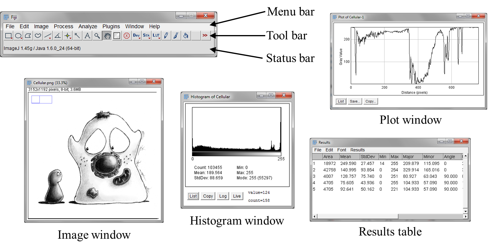
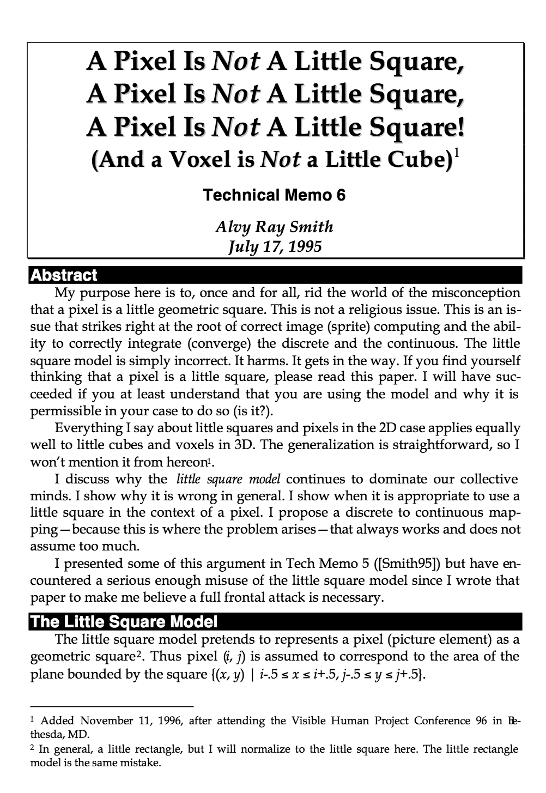


= Images & pixels

[.chapter-outline]
.Chapter outline
--
* Digital images are composed of pixels
* Each pixel has a numeric value, often related to detected light
* The same pixel values can be displayed in different ways
* In scientific image processing, image appearance can be changed independently of pixel values by modifying a lookup table
--

== Introduction

The smallest units from which an image is composed are its _pixels_.

The word 'pixel' is derived from __pic__ture __el__ement and, as far as the
computer is concerned, each pixel is just a number.

When the image data is displayed, the values of pixels are usually converted into squares of
particular colors – but this is only for our benefit to allow us to get
a fast impression of the image contents, i.e. the approximate values of
pixels and where they are in relation to one another.

When it comes to processing and analysis, we need to get past the display and delve into
the real data: the numbers.

This distinction between data (the pixel values) and display (the
colored squares) is particularly important in fluorescence microscopy.
The pixels given to us by the microscope are measurements of the light
being emitted by a sample. From these we can make deductions, e.g. more
light may indicate the presence of a particular structure or substance,
and knowing the exact values allows us to make comparisons and
quantitative measurements. On the other hand, the colored squares do
not matter for measurements: they are just nice to look at
(Figure <<fig-image_array>>).

[sidebar]
[[fig-image_array, 1]]
--
[cols="a,a,a"]
[frame=none, grid=none, halign=center]
|===
|image::images/couple_selected.png[title="Original image" caption="A: " float=center]
|image::images/couple_squares.png[title="Enlarged view from (A)" caption="B: " float=center]
|image::images/couple_text.png[title="Pixel values of (B)" caption="C: " float=center]
|===
**Figure {counter:figure}:** An image depicting an interestingly-matched couple I saw when walking home from work around the time of writing. (A) & (B) The image is shown using small squares of different shades of gray, where each square corresponds to a single pixel. This is only a convention used for display; the pixels themselves are stored as arrays of numbers \(C) – but looking at the numbers directly it is pretty hard for us to visualize what the image contains.
--

Still, two related facts can cause us
trouble:

[.standout]
****
1.  Images that _look the same_ can contain _different_ pixel values
2.  Images that _look different_ can still contain _the same_ pixel values
****

This makes it quite possible to analyze two different images that
_appear_ identical, but to get very different results. Therefore to be
sure we are observing and measuring the right things, we need to know
what is happening whenever we open, adjust and save our images. It is
not enough to trust our eyes.

[[imagej-fiji]]
ImageJ & Fiji
-------------

So to work with our digital images we do not just need any software that
can handle images: we need scientific software that allows us to explore
our data and to control exactly what happens to it.

ImageJ, developed at the National Institutes of Health by Wayne Rasband,
is designed for this purpose. The 'J' stands for Java: the programming
language in which it is written. It can be downloaded for free from
http://imagej.net, and its source code is in the public domain, making
it particularly easy to modify and distribute. Moreover, it can be
readily extended by adding extra features in the form of _plugins_,
_macros_ or __scripts__.footnote:[
All three of these consist of some computer-readable instructions, but they are written in slightly different languages.
Macros are usually the easiest and fastest to write, and we will start producing our own in <<../macro_intro/macro_intro.adoc#chap, Writing macros>>.
For more complex tasks, the others my be preferable.]

This marvellous customizability has one potential drawback: it can be
hard to know where to start, which optional features are really good,
and where to find them all. Fiji, which stands for _Fiji Is Just
ImageJ_, goes some way to addressing this. It is a distribution of
ImageJ that comes bundled with a range of add-ons intended primarily for
life scientists. It also includes its own additional features, such as
an integrated system for automatically installing updates and bug-fixes,
and extra open-source libraries that enable programmers to more easily
implement sophisticated algorithms.

Therefore, everything ImageJ can do can also be accomplished in Fiji
(because Fiji contains the full ImageJ inside it), but the converse is
not true (because Fiji contains many extra bits). Therefore in this
course we will use Fiji, which can be downloaded for free from
http://fiji.sc/.

.ImageJ, ImageJ2 & Fiji
****
When this handbook was first written, a project to rewrite ImageJ to create ImageJ2 was still in the early stages of development.

Now, ImageJ2 has become much more established, and is part of Fiji.

Fortunately, ImageJ2 aims to be backwards-compatible with ImageJ - therefore if you just download Fiji from http://fiji.sc/ then you should have the right thing to work along with this handbook.footnote:[The distinction between ImageJ and ImageJ2 does not need to concern us here, although if you are interested you can read more https://imagej.net/Frequently_Asked_Questions#What_is_the_difference_between_ImageJ1_and_ImageJ2.3F[here].  Also, if for any reason you would like to get ImageJ 'only', without the extras of ImageJ2 or Fiji, you still can at https://imagej.nih.gov/ij/]
****

[[sec_digital_fiji_interface]]
The user interface
~~~~~~~~~~~~~~~~~~

[sidebar]
[[fig-fiji_gui, 2]]
--

**Figure {counter:figure}:** The main user interface for Fiji.
--

It can take some time to get used to the ImageJ/Fijifootnote:[At the
risk of confusion, I will refer to ImageJ most of the time, and Fiji
only whenever discussing a feature not included within ImageJ.] user
interface, which may initially seem less friendly and welcoming than
that found in some commercial software. But the good news is that, once
you find your way around, it becomes possible to _do_ a lot of things
that would simply not be possible in many other software applications.

Some of the components we will be working with are shown in
Figure <<fig-fiji_gui>>. At first, only the main window containing the
menu, tool and status bars is visible, and the others appear as needed
when images are opened and processed. Should you ever lose this main
window behind a morass of different images, you can bring it back to the
front by pressing the kbd:[Enter] key.

[[tips-tricks]]
Tips & tricks
~~~~~~~~~~~~~

Here are a few non-obvious tips that can making working with ImageJ or
Fiji easier, in order of importance (to me):

* Files can be opened quickly by dragging them (e.g. from the desktop,
Windows Explorer or the Mac Finder) onto the `Status bar`. Most plugins
you might download can also be installed this way.
* If you know the name of a command (including plugins) but forget where
it is hidden amidst the menus, type kbd:[Ctrl + L] (or perhaps just kbd:[L]) to
bring up the `Command Finder` – it may help to think of it as a __L__ist
– and start typing the name. You can run the command directly, or select
`Show full information` to find out its containing menu. Note that some
commands have similar or identical names, in which case they might only
be distinguishable by their menu.
* ImageJ's menu:Edit[Undo] has very limited abilities – it _may_ be
available if you modify a single 2D image, but will not be if you
process data with more dimensions (see <<../dimensions/dimensions.adoc#chap, Dimensions>>). While
inconvenient if you are used to long undo-lists in software like
Microsoft Word or Adobe Photoshop, there is a good rationale behind it:
supporting undo could require storing multiple copies of previous
versions of the image, which might rapidly use up all the available
memory when using large data sets. The solution is to take care of this
manually yourself by choosing menu:Image[Duplicate...] to create a copy of
the image before doing any processing you may not wish to keep.
* There is a wide range of shortcut keys available. Although the menus
claim you need to type kbd:[Ctrl], you do not really unless the option under
menu:Edit[Options > Misc...] tells you otherwise. You can also add more
shortcuts under menu:Plugins[Shortcuts > Create Shortcut...]
* To move around large images, you can use the `scrolling tool` , or
simply click and drag on the image while holding down the kbd:[spacebar]. A
small rectangular diagram (visible on the top left of the image window
in Figure <<fig-fiji_gui>>) indicates which part of the entire image is
currently being shown.
* There are more tools and options than meet the eye. Double-clicking
and right-clicking on icons in the `Tool bar` can each reveal more
possibilities.
* Pressing kbd:[Escape] _may_ abort the operation of any currently-running
command... But it requires the command's author to have implemented this
functionality. So it might not do anything.

[[finding-more-information]]
Finding more information
~~~~~~~~~~~~~~~~~~~~~~~~

Links to more information for using ImageJ, including user guides including a detailed manual,
are available at http://imagej.net/Introduction.

.Referencing Fiji and ImageJ
[.info]
****
Whenever publishing work using Fiji or
ImageJ, you should check their respective websites for information
regarding how to refer to them. Furthermore, some specific plugins have
their own published papers that should be cited if the plugins are used.

See the http://imagej.net/Citing for more information.
****

[[data-its-display]]
Data & its display
------------------

[[comparing-images]]
Comparing images
~~~~~~~~~~~~~~~~

Now we return to the data/display dichotomy. In the top row of
Figure <<fig-histogram_comparison>>, you can see four images as they might
be shown in ImageJ. The first and second pairs both _look_ identical to
one another. However, it is only actually (A) and \(C) that _are_ identical in
terms of content. Since these contain the original pixel values given by
the microscope they could be analyzed, but analyzing either (B) or (D) instead
may well lead to untrustworthy results.

[sidebar]
[[fig-histogram_comparison, 3]]
--
[cols="a,a,a,a"]
[frame=none, grid=none, halign=center]
|===
|image::images/sunny_square_grays_16.png[]
|image::images/sunny_square_grays_8.png[]
|image::images/sunny_square_lut_16.png[]
|image::images/sunny_square_rgb.png[]

|image::images/sunny_square_grays_16_hist.png[title="16-bit ('Grays' LUT)", caption="A: "]
|image::images/sunny_square_grays_8_hist.png[title="8-bit ('Grays' LUT)", caption="B: "]
|image::images/sunny_square_lut_16_hist.png[title="16-bit ('Fire' LUT)", caption="C: "]
|image::images/sunny_square_rgb_hist.png[title="8-bit (RGB)", caption="D: "]

|===
**Figure {counter:figure}:**
Do not trust your eyes for image comparisons: different pixel values might be displayed so that they look the same, while the same pixel values may be displayed so that they look different.
Here, only the images in (A) and \(C) are identical to one another in terms of their pixel values -- and only these contain the original data given by the microscope.
The terms used in the captions will be explained in <<../bit_depths/bit_depths.adoc#chap, Types & bit-depths>> and <<../colors/colors.adoc#chap, Channels & colors>>.
--

Reliably assessing the similarities and differences between images in
Figure <<fig-histogram_comparison>> would therefore be impossible just
based on their appearance in the top row, but it becomes much easier if
we consider the corresponding _image histograms_ below. These histograms (created
with menu:Analyze[Histogram]) depict the total number of pixels with each
different value within the image as a series of vertical bars, displayed
above some extra statistics – such as the maximum, minimum and mean of
all the pixels in that image. Looking at the histograms and the
statistics below make it clear that only (A) and \(C) could possibly contain the
same values.

.Question
[.question]
****
If you want to tell whether two images are identical, is comparing their
histograms _always_ a reliable method?

.Answer
[.solution]
--
No! It is possible for two quite different images to have identical
histograms. For example, if you imagine having an image and then
randomly reshuffling its pixels to get a second image, then the
histogram would be unchanged but the image itself would be. Other, more
subtle differences could also lead to different arrangements of pixels
(and therefore different images), but similar appearances and identical
histograms and statistics.

Nevertheless, histogram comparison is fast (in ImageJ, just click on
each image and press kbd:[H]) and a pretty good guide. Non-identical
histograms would least show that images are categorically _not_ the
same. A more reliable method of comparing images will come up in
<<../point_operations/point_operations.adoc#chap, Manipulating individual pixels>>.
--

****

[[mapping-colors-to-pixels]]
Mapping colors to pixels
~~~~~~~~~~~~~~~~~~~~~~~~~

The reason for the different appearances of images in
Figure <<fig-histogram_comparison>> is that the first three do not all use
the same _lookup tables_ (LUTs; sometimes alternatively called _color
maps_), while in (D) the image has been
_flattened_. Flattening will become relevant in <<../colors/colors.adoc#chap, Channels & colors>>,
but for now we will concentrate on LUTs.

A LUT is essentially a table in which rows give possible pixel values
alongside the colors that should be used to display them. For each
pixel in the image, ImageJ finds out the color of square to draw on
screen by 'looking up' its value in the LUT. This means that when we
want to modify how an image appears, we can simply change its LUT –
keeping all our pixel values safely unchanged.

.Practical
[.practical]
****
image:images/spooked_8-bit.png[200,200,float="right"]
Using `Spooked.tif` as an example image, explore pixel values and LUTs
in Fiji. Originally, each pixel should appear with some shade of gray
(which indicates a correspondingly sombre LUT). As you move the cursor
over the image, in the status bar at the top of the screen you should
see `value =` beside the numerical value of whichever pixel is
underneath the cursor.

If you then go to menu:Image[Lookup Tables...] and click on some other LUT
the image appearance should be instantly updated, but putting the cursor
over the same pixels as before will reveal that the actual values are
unchanged.

Finally, if you want to 'see' the LUT you are using, choose
menu:Image[Color > Show LUT]. This shows a bar stretching from 0 to 255 (the
significance of this range will be clearer after
reading <<../bit_depths/bit_depths.adoc#chap, Types & bit-depths>>) with the color given to each value in
between. Clicking `List` then shows the actual numbers involved in the
LUT, and columns for `Red`, `Green` and `Blue`. These latter columns
give instructions for the relative amounts of red, green and blue light
that should be mixed to get the right color (see
<<../colors/colors.adoc#chap, Channels & colors>>).
****

[[why-use-different-luts]]
Why use different LUTs?
^^^^^^^^^^^^^^^^^^^^^^^

The ability to change LUTs has several advantages. A simple one is that
we can use LUTs to make the colors in our image match with the
wavelengths of the light we have detected, such as by showing a DAPI
staining in blue or GFP in green. But often this is not really optimal,
and you may prefer to show an image using some multicolored LUT (e.g.
`Fire` in ImageJ) that does not otherwise have any physical relevance.
This is because the eye is relatively poor at distinguishing different
shades of the same color, and presenting the identical information
using many different colors can make differences between pixel values
more apparent.

[[modifying-the-lut-can-help-make-information-visible]]
Modifying the LUT can help make information visible
^^^^^^^^^^^^^^^^^^^^^^^^^^^^^^^^^^^^^^^^^^^^^^^^^^^

But swapping one set of LUT colors for another is not the only way to
change the appearance. We can also keep the same colors, but change
which pixel values each color is used for.

For example, suppose we have chosen a gray LUT. Most monitors can
(theoretically) show us 256 different shades of gray, so we can give a
different shade to pixels with values from 0–255, where 0 corresponds to
black and 255 corresponds to white. But suppose our image only contains
interesting values in the range 5–50. Then we will only be using 46
rather similar shades of gray to display it, and not using either our
monitor or our eyesight to their full capacities. It would easier to see
what is happening if we made every pixel with a value
&le; 5 black and &ge; 50 white, and then
distributed all our available shades of gray to the values in between.
This would make full use of the colors we have in our LUT, and give us
an image with improved _contrast_. Of course, we can also apply the same
principle using any other LUT, replacing black and white with the first
and last colors in the LUT respectively.

[[adjusting-the-display-range]]
Adjusting the display range
^^^^^^^^^^^^^^^^^^^^^^^^^^^

[sidebar]
[[fig-contrast_sun, 4]]
--
[cols="a,a,a"]
[frame=none, grid=none, halign=center]
|===
|image::images/contrast_sun_gray_1.jpg[title="Grayscale" caption="A: "]
|image::images/contrast_sun_gray_2.jpg[title="Grayscale" caption="B: "]
|image::images/contrast_sun_fire.jpg[title="Fire LUT" caption="C: "]
|===
**Figure {counter:figure}:**
The same image can be displayed in different ways by adjusting the contrast settings or the LUT.
Nevertheless, despite the different appearance, _the values of the pixels are the same in all three images_.
--

This type of LUT adjustment is done in ImageJ using the
menu:Image[Adjust > Brightness/Contrast...] command (quickly accessed by
typing kbd:[Shift + C]; see Figure <<fig-contrast_sun>>). The first two
scrollbars that appear are called `Minimum` and `Maximum`, and these
define the thresholds below and above which pixels are given the first
or last LUT color respectively. Modifying either of these sliders
automatically changes the `Brightness` and `Contrast` sliders.

Although the terms brightness and contrast are probably more familiar, it is
usually easier to work with `Minimum` and `Maximum`. If you know, for
example, you do not care to see anything in the darkest part of the
image, you can increase the value of `Minimum` to clip it out of the
picture (only for display!), and devote more different colors for the
part of the image that is really interesting.

.Practical
[.practical]
****
Return again to `Spooked.tif` and investigate the contents of the image
by adjusting the `Minimum` and `Maximum` sliders. What are the best
settings when viewing the image?

After you have done this, explore the effects of pressing the btn:[Auto],
btn:[Reset], btn:[Set] and btn:[Apply] buttons on the `Brightness/Contrast` panel.

(And subsequently be wary of using the btn:[Apply] button ever again...)

.Answer
[.solution]
--
When the `Minimum` is set to 0 and the `Maximum` is greatly reduced, an
eerier picture should emerge. This was always present in the pixel data,
but probably could not be seen initially.

In images like this, the 'best' contrast setting really depends upon
what it is you want to see – although <<../point_operations/point_operations.adoc#chap, Manipulating individual pixels>>
describes one way to try to see 'everything at once'.

With regard to the buttons, btn:[Auto] choses contrast settings that might
look good (by bringing `Minimum` and `Maximum` a bit closer to one
another). btn:[Reset] makes sure `Minimum` and `Maximum` match with the
actual minimum and maximum pixel values in the image (or 0 and 255 for
an 8-bit image – see <<../bit_depths/bit_depths.adoc#chap, Types & bit-depths>>), while `Set` allows you to
input their values manually.

btn:[Apply] is altogether more dangerous. It really does change the pixel
values of the image. _This loses information and so is rarely a good
idea!_ After pressing btn:[Apply], you are very likely not to be able to get
your original pixel values back again.
--

****

[sidebar]
[[fig-similarities_and_differences, 5]]
--
[cols="a,a"]
[frame=none, grid=none, halign=center]
|===
|image::images/fundamentally_similar.jpg[title="Fundamentally the same -- despite different appearances", caption="A: "]
|image::images/fundamentally_different.jpg[title="Fundamentally different -- despite the same (or similar) appearance", caption="B: "]
|===
**Figure {counter:figure}:**
The same person may appear very different thanks to changes in clothing and accessories (A).
Conversely, quite different people might be dressed up to look very similar, and it is only upon closer inspection that significant differences become apparent (B).  The true identity and dressing can be seen as analogous to an image's pixel values and its display.
--

.Scientific image analysis is not photo editing!
[.info]
****
One way to imagine the distinction between pixel values and a LUT is that the former determine
the real _identity_ of the image, while the latter is simply the
_clothing_ the image happens to be wearing
(Figure <<fig-similarities_and_differences>>). Our interest is in the
identity; the clothing is incidental, though might be chosen to accent
certain features of interest.

It is vital for scientific analysis that changing the LUTs, either by
switching the colors or adjusting `Brightness/Contrast`, does not mess
up or otherwise modify the underlying data. This is the case for the
normal contrast controls in ImageJ (if you avoid the tempting btn:[Apply]
button). But this feature would not be so important in other
applications like photo editing, where only the final appearance is what
matters. Therefore, if you adjust the brightness, contrast or 'levels'
in Photoshop, for example, you really _do_ change the underlying pixel
values – and, once changed, you cannot 'change them back' (apart from
using the `Undo` command) and expect to get your original values.

_Therefore, if you have enhanced an image in Photoshop, your pixel
values can easily be changed in a way that makes their reliable
interpretation no longer possible!_
****

[[sec-pixel_sizes]]
Properties & pixel size
-----------------------

Hopefully by now you are appropriately paranoid about accidentally
changing pixel values and therefore compromising your image's integrity,
so that if in doubt you will always calculate histograms or other
measurements before and after trying out something new to check whether
the pixels have been changed.

This chapter ends with the other important characteristic of pixels for
analysis: their _size_, and therefore how measuring or counting them
might be related back to identifying the sizes and positions of things
in real life. Sizes also need to be correct for much analysis to be
meaningful.

[sidebar]
[[fig-px_sizes, 6]]
--
[cols="a,a,a,a"]
[frame=none, grid=none, halign=center]
|===
|image::images/px_size_600.png[title="600 × 600 pixel image and its properties" caption="A: "]
|image::images/px_size_600_props.png[title=""]
|image::images/px_size_75.png[title="75 × 75 pixel image and its properties" caption="B: "]
|image::images/px_size_75_props.png[title=""]
|===
**Figure {counter:figure}:**
Two images with the same field of view, but different numbers of pixels -- and therefore different pixel sizes.
In (A) the pixel width and height are both 64.2µm / 600px = 0.107µm.  In (B) the pixel width and height are both 64.2µm / 75px = 0.856µm/px.
For display, (B) has been scaled up to look the same size as (A), so its larger pixels make it appear more 'blocky'.
--

Pixel sizes are found in ImageJ under menu:Image[Properties...], where you
will see values for `Pixel width` and `Pixel height`, defined in terms
of `Unit of Length`. A useful way to think of these is as proportions of
the size of the total field of view contained within the image (see
Figure <<fig-px_sizes>>). For example, suppose we are imaging an area with
a width of 100µm, and we have 200 pixels in the horizontal direction of
our image. Then we can treat the 'width' of a pixel as
100/200 = 0.5µm. The pixel height can be defined and used
similarly, and is typically (but not necessarily) the same as the width.

.Pixel squareness
[.info]
****

Talking of pixels as having (usually) equal widths and
heights makes them sound very square-like, but earlier I stated that
pixels are not squares – they are just displayed using squares.

This slightly murky philosophical distinction is considered in Alvy Ray
Smith's technical memo (_right_), the title of which gives a good
impression of the central
thesis.footnote:[See http://alvyray.com/Memos/CG/Microsoft/6_pixel.pdf] In
short, pushing the pixels-are-square model too far leads to confusion in
the end (e.g. what would happen at their 'edges'?), and does not really
match up to the realities of how images are recorded (i.e. pixel values
are not determined by detecting light emitted from little square
regions, see <<../formation_spatial/formation_spatial.adoc#chap, Blur & the PSF>>). Alternative terms, such
as _sampling distance_, are often used instead of pixel sizes – and are
potentially less misleading. But ImageJ uses pixel size, so we will as
well.

****

[[pixel-sizes-and-measurements]]
Pixel sizes and measurements
~~~~~~~~~~~~~~~~~~~~~~~~~~~~

Knowing the pixel size makes it possible to calibrate size measurements.
For example, if we measure some structure horizontally in the image and
find that it is 10 pixels in length, with a pixel size of 0.5µm, we can
deduce that its actual length in reality is (roughly!)
10 × 0.5µm = 5µm.

This calibration is often done automatically when things are measured in
ImageJ (see <<../rois/rois.adoc#chap, Measurements & regions of interest>>), and so the sizes must be correct for the
results to be reasonable. All being well, appropriate pixel sizes will be written into an
image file during acquisition and subsequently read – but this does not
always work out (see <<../files/files.adoc#chap, Files & file formats>>), and so `Properties...` should
always be checked. If ImageJ could not find sensible values in the image
file, by default it will say each pixel has a width and height of 1.0
pixel... not very informative, but at least not wrong. You can then
manually enter more appropriate values if you know them.

[[pixel-sizes-and-detail]]
Pixel sizes and detail
~~~~~~~~~~~~~~~~~~~~~~

In general, if the pixel size in a fluorescence image is large then we
cannot see very fine detail (see Figure <<fig-px_sizes>>). However, the
subject becomes complicated by the diffraction of light whenever we are
considering scales of hundreds of nanometers, so that acquiring images
with smaller pixel sizes does not necessarily bring us extra information
– and might actually become a hindrance.

This will be explored in more detail in later chapters (<<../formation_spatial/formation_spatial.adoc#chap, Blur & the PSF>> and <<../formation_noise/formation_noise.adoc#chap, Noise>>).
