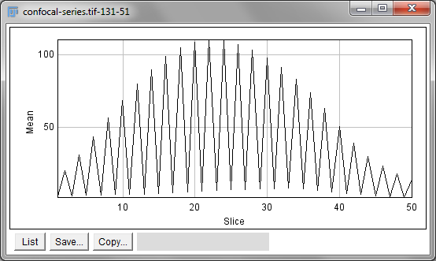


= Processing data with higher dimensions

[.chapter-outline]
.Chapter outline
--
* Many processing operations can be extended into more than 2 dimensions
* Adding extra dimensions can greatly increase the processing requirements
* Objects can be detected & measured in 3D
--

[[introduction]]
Introduction
------------

So far, in terms of image processing we have concentrated only on 2D images.
Most of the operations we have considered can also be applied to 3D data – and
sometimes data with more dimensions, in cases where this is meaningful.

[[sec-type_converting_3d]]
Point operations, contrast & conversion
---------------------------------------

Point operations are straightforward: they depend only on individual
pixels, so the number of dimensions is unimportant. Image arithmetic
involving a 3D stack and a 2D image can also be carried out in ImageJ
using the `Image Calculator`, where the operation involving the 2D image
is applied to each slice of the 3D stack in turn. Other options, such as
filtering and thresholding, are possible, but bring with them extra
considerations – and often significantly higher computational costs.

Setting the LUT of a 3D image requires particular care. The normal
`Brightness/Contrast...` tool only takes the currently-displayed slice
into consideration when pressing btn:[Reset] or btn:[Auto]. Optimizing the
display for a single slice does not necessarily mean the rest of the
stack will look reasonable if the brightness changes much.
menu:Process[Enhance Contrast...] is a better choice, since here you can
specify that the information in the entire stack should be used. You can
also specify the percentage of pixels that should be saturated (clipped)
_for display_, i.e. those that should be shown with the first or last
colors in the LUT. So long as `Normalize` and `Equalize histogram` are
not selected, the pixel values will not be changed.

.Question
[.question]
****
By default, the percentage of saturated pixels in `Enhance Contrast...` is
set to 0.4. Why might this be chosen instead of 0?

.Answer
[.solution]
--
If the percentage of saturated pixels is 0, then the minimum and maximum
pixel values throughout the image will be given the first and last LUT
colors respectively, with all other colors devoted to values in
between. This is sensitive to outliers, and often results in images that
have poor contrast. It is usually better to accept some small amount of
visual saturation, in order to give more LUT colors to the pixel values
between the extremes.
--

****

.Converting bit-depths of multidimensional images
[.info]
****
As described in <<../bit_depths/bit_depths.adoc#sec-bit_depth_converting, Types & bit-depths>>, the minimum and maximum display
range values are used by default when reducing the bit-depth of an
image. To minimize the information lost, these should usually be set to the
minimum and maximum pixel values within the image – otherwise values
will be clipped. In 2D it is enough to press btn:[Reset] in the
`Brightness/Contrast` window, _but in 3D this will only work if the
minimum and maximum values from the entire stack happen to appear on the
current slice!_

For this reason, it is good practice to run `Enhance Contrast...`
prior to reducing bit-depths of stacks, setting the saturation to 0 and
using the entire stack. This means no pixels will be clipped in the
output (although rescaling and rounding will still occur).
****

[[d-filtering]]
3D filtering
------------

Many filters naturally lend themselves to being applied to as many
dimensions as are required. For example, a 3 × 3 mean
filter can easily become a 3 × 3 × 3 filter if
averaging across slices is allowed. Significantly, it then replaces each
pixel by the average of 27 values, rather than 9. This implies the
reduction in noise is similar to that of applying a
5 × 5 filter (25 values), but with a little less
blurring in 2D and a little more along the third dimension instead.
Several 3D filters are available under the menu:Plugins[Process > ] submenu.

[[sec-separable_filters]]
Fast, separable filters
~~~~~~~~~~~~~~~~~~~~~~~

The fact that 3D filters inherently involve more pixels is one reason
that they tend to be slow. However, if a filter happens to have the very
useful property of _separability_, then its speed can be greatly
improved. Mean and Gaussian filters have this property, as do minimum
and maximum filters (of certain shapes) – but not median.

The idea is that instead of applying a single
_n_ × _n_ × _n_ filter, three different 1D filters of
length _n_ can be applied instead – rotated so that they are
directed along each dimension in turn. Therefore rather than
_n_^3^ multiplications and additions being required to
calculate each pixel in the linear case (e.g. see <<../filters/filters.adoc#fig-convolution, Filters>>),
only _3n_ multiplications and additions are required. With
millions of pixels involved, even when __n__ is small the
saving can be huge. Figure <<fig-gauss_separable>> shows the basic idea in
2D, but it can be extended to as many dimensions as needed.
menu:Process[Filters > Gaussian Blur 3D...] uses this approach.

[sidebar]
[[fig-gauss_separable, 1]]
--
[cols="3*a"]
[frame=none, grid=none, halign=center]
|===
|image::images/safe_orig.png[title="Original image" caption="A: " float=center]
|image::images/safe_horizontal.png[title="Horizontally smoothed (A)" caption="B: " float=center]
|image::images/safe_blurred.png[title="Horizontally smoothed (B)" caption="C: " float=center]
|===
**Figure {counter:figure}:**
Smoothing applied separably using a 1D Gaussian filter (first aligned horizontally, then vertically) to an image or a rather well-protected young man seen playing safely on the streets of Heidelberg in 2010.
The end result \(C) is the same as what would be obtained by applying a single, 2D Gaussian filter to (A).
--

.Fast filters & the Fourier transform
[.info]
****
Not all linear filters are
separable, and applying a large, non-separable linear filter can also be
extremely time-consuming. However, when this is the case a whole other
method can be used to get the same result using the Fourier transform –
where the speed no longer has the same dependence upon the filter size.
Unfortunately, the Fourier method cannot be used for non-linear filters
such as the median filter.
****

[[dimensions-isotropy]]
Dimensions & isotropy
~~~~~~~~~~~~~~~~~~~~~

If applying a filter in 3D instead of 2D, it may seem natural to define
it as having the same size in the third dimension as in the original
two. But for a __z__-stack, the spacing between slices is
usually larger than the width and height of a pixel. And if the third
dimension is time, then it uses another scale entirely. Therefore more
thought usually needs to be given to what sizes make most sense.

In some commands (e.g. menu:Plugins[Processor > Smooth (3D)]), there is a
`Use calibration` option to determine whether the values you enter are
defined in terms of the units found in the `Properties...` and therefore
corrected for the stored pixel dimensions. Elsewhere (e.g.
`Gaussian Blur 3D...`) the units are pixels, slices and time points – and
so you are responsible for figuring out how to compensate for different
scales and units.

[[thresholding-multidimensional-data]]
Thresholding multidimensional data
----------------------------------

When thresholding an image with more than 2 dimensions using the
`Threshold...` command, it is necessary to choose whether the threshold
should be determined from the histogram of the entire stack, or from the
currently-visible 2D slice only. If the latter, you will also be asked
whether the same threshold should be used for every slice, or if it
should be calculated anew for each slice based upon the slice histogram.
In some circumstances, these choices can have a very large impact upon
the result.

.Question
[.question]
****
When you threshold a stack, you have an option to choose
`Stack Histogram`. Then, when you choose btn:[Apply] you are asked if you
want to `Calculate Threshold for Each Image`. What difference do you
expect these two options to make, and what combinations would you use
for:

1.  a stack consisting of 2D images from different color channels
2.  a __z__-stack
3.  a time series

_Note:_ Have a look at what happens when you click `Auto` while
scrolling through one channel of the stack
menu:File[Open Samples > Mitosis (26 MB, 5D Stack)], with and without `Stack Histogram`
selected. You will have to split the channels for this because ImageJ
currently refuses to threshold multichannel images with extra dimensions
(which helps avoid some confusion). `Dark Background` should always be
selected here.

.Answer
[.solution]
--
If `Stack Histogram` is checked, the thresholds are computed from a
histogram of all the pixels in the entire image stack; otherwise, the
histogram of only the currently-displayed image slice is used.

BUT! If `Calculate Threshold for Each Image` is chosen, then this is ignored:
the threshold is always determined by the selected automatic method
using the histogram of the corresponding slice only.

Therefore, the most sensible combinations of thresholding options to use
depend upon the type of data.

1.  _color channels_ – There is often no good reason to suppose the
amount of fluorescence in different color channels will be similar, and
so thresholds should be calculated from each channel independently.
2.  _z-Stacks_ – It is normally a good idea to use the stack histogram
with __z__-stacks. If you do not, then your threshold will be
affected by whatever slice you happen to be viewing at the time of
thresholding – introducing a potentially weird source of variability in
the results. It is probably _not_ a good idea to calculate a new
threshold for each slice, because this would lead to at least
_something_ being detected on every slice. But in the outer slices there
may well only be blur and noise – in which case nothing _should_ be
detected!
3.  _Time series_ – In a time series, bleaching can sometimes cause the
image to darken over time. In such a case, using the stack histogram
might cause fewer pixels to exceed the threshold at later time points
simply for this reason, and recalculating the threshold for each image
may be better. On the other hand, if images were previously normalized
somehow to compensate for bleachingfootnote:[See
http://imagej.net/Bleach_Correction], then the stack
threshold might be preferable again. It's tricky.

There is one other implementation issue that needs attention. When
`Dark Background` is checked and an automated threshold is computed,
then it is only really the low threshold that matters – the high
threshold is always set to the maximum in the histogram to ensure that
all brighter pixels are designated 'foreground' in the result. However,
if not using `Stack Histogram`, then for non-8-bit images the histograms
are calculated using the minimum and maximum pixels on the slice, and
consequently the high threshold cannot be higher than this maximum value
(look at how the high threshold value changes in `Mitosis` as you
compute auto thresholds for different slices). This means that any
brighter pixels will be _outside_ the threshold range (and therefore
'background') if they occur on a different slice. This can cause holes
to appear in the brightest parts of structures, and is probably not what
you want. A similar situation occurs with the low threshold when
`Dark Background` is unchecked.
--

****

[[measurements-in-3d-data]]
Measurements in 3D data
-----------------------

ImageJ has good support for making measurements in 2D, particularly the
`Measure` and `Analyze Particles...` commands. The latter can happily
handle 3D images, but only by creating and measuring 2D ROIs
independently on each slice. Alternatively,
menu:Image[Stacks > Plot Z-axis Profile] is like applying `Measure` to each
slice independently, making measurements either over the entire image or
any ROI. It will also plot the mean pixel values, but even if you do not
particularly want this the command can still be useful. However, if
single measurements should be made for individual objects that extend
across multiple slices, neither of these options would be enough.

.Practical
[.practical]
****

image:images/widest_roi_1.png[120,120,float="right"]

image:images/widest_roi_2.png[120,120,float="right"]

image:images/widest_roi_3.png[120,120,float="right"]

Suppose you have a cell, nucleus or some other large 3D structure in a __z__-stack,
and you want to draw the smallest 2D ROI that completely contains it on
every slice. An example is shown on the right for the green structure in
the `Confocal Series` sample image.

How would you create such a ROI, and be confident that it is large
enough for all slices?

.Answer
[.solution]
--
My strategy would be to create a z-projection (max intensity) and then draw the ROI
on this – or, preferably, create the ROI by thresholding using
menu:Image[Adjust > Threshold] and the `Wand` tool. This ROI can then be
transferred over to the original stack, either via the ROI Manager or
menu:Edit[Selection > Restore Selection].
--

****

.Practical
[.practical]
****

image:images/widest_roi_2.png[height=120,float="right"]

When I create a ROI on the sample image `Confocal Series` and run
`Plot Z-axis Profile`, I get a strangely spikey result (shown right).
How could this be explained?

(I used Fiji/ImageJ 1.46k. This behavior has been corrected since
then.)

.Answer
[.solution]
--
`Confocal Series` has two channels: it is a hyperstack (4D). But
`Plot Z-axis Profile` ignored this previously, and treated it like a
stack (3D). Therefore measurements from each channel were interleaved
with one another. Splitting the channels first, then calculating the
profiles separately would overcome this.
--

****

[[histograms-threshold-clipping]]
Histograms & threshold clipping
~~~~~~~~~~~~~~~~~~~~~~~~~~~~~~~

One way to measure in 3D is to use the `Histogram` command and specify
that the entire stack should be included – this provides some basic
statistics, including the total number, mean, minimum, maximum and
standard deviation of the pixelsfootnote:[Be careful! If you have
multiple channels, these should be split first.]. This will respect the
boundaries of a 2D ROI if one has been drawn.

This is a start, but it will not adjust to changes in the object
boundary on each 2D plane. A better approach could be to use
menu:Image[Adjust > Threshold...] to set a threshold that identifies the
object – but do _not_ press btn:[Apply] to generate a binary image. Rather,
under menu:Analyze[Set Measurements...] select `Limit to threshold`. Then
when you compute the stack histogram (or press `Measure` for 2D) only
above-threshold pixels will be included in the statistics. Just be sure
to reset `Limit to threshold` later.

.Question
[.question]
****
How can you translate the total number of pixels in an object into its
volume, e.g. in µm^3^? Give some thought to how accurate your
method will be.

.Answer
[.solution]
--
You could treat each pixel as a rectangular cuboid, with a volume equal
to _pixel width_ × _pixel height_ × _voxel depth_ (as given in menu:Image[Properties...]). Then multiply this by the number of
pixels within the object. This is what the <<sec-3d_od, `3D Objects Counter`>>  plugin
does when measuring volumes.

Whenever you want to compare object sizes across images acquired with
different pixel sizes, this is certainly better than just taking the raw
pixel counts as measures of volume. However, it is unlikely to be very
accurate – and volume measurements obtained this way should not be
trusted too much, especially when dealing with very small sizes. They
are also likely to be quite sensitive to spacing.
--

****

.Using NaNs
[.info]
****
I am not a fan of `Limit to threshold`, because I am likely
to forget to reset it afterwards and may subsequently measure the wrong
things for days thereafter.

An alternative that I prefer is to set my threshold on a 32-bit copy of
the image I am working with, and then btn:[Apply] the threshold using the
`Set Background Pixels to NaN` option. Then all below-threshold pixels
will automatically be excluded from any measurements I make on the
result, since they are 'no longer numbers' (see
<<../thresholding/thresholding.adoc#sec-thresholding_nans, Detecting by thresholding>> for more details).
****

[[sec-3d_oc]]
The 3D Objects Counter
~~~~~~~~~~~~~~~~~~~~~~

Currently, the closest thing to `Analyze Particles...` for measuring
connected objects in 3D built-in to Fiji is the 3D Objects Counter
(menu:Analyze[3D Objects Counter])footnote:[See See S Bolte and F P Cordelières. “A guided tour into subcellular colocalization analysis in light microscopy.” In: Journal of Microscopy 224.Pt 3 (Dec. 2006), pp. 213–32. url: http://www.ncbi.nlm.nih.gov/pubmed/17210054]. Its settings (analogous
to `Set Measurements...`) are under menu:Analyze[3D OC Options]. In addition
to various measurements, it provides labelled images as output, either
of the entire objects or only their central pixels – optionally with
labels, or expanded to be more visible.

.Find Connected Regions
[.info]
****
menu:Plugins[Process > Find Connected Regions] is a
command primarily for creating labelled images from thresholded 3D data,
which can also give the total number of pixels per object. If the main
thing you want is the labelled image without many more results, it may
be faster than `3D Objects Counter`.
****

.Additional 3D tools
[.info]
****
For working with 3D data, it may be very useful to
download the '3D ImageJ Suite' from
http://imagejdocu.tudor.lu/doku.php?id=plugin:stacks:3d_ij_suite:start.
This not only includes a range of fast filters and commands for
segmentation, but also a 3D version of the ROI Manager.

While created for bone image analysis, _BoneJ_ (http://bonej.org/) also
includes some components that are useful for general applications –
including a fast http://bonej.org/particles[3D Particle Analyser]
(another alternative to the 3D Objects Counter) and a tool to
http://bonej.org/utilities[interpolate ROIs across image slices].
****
